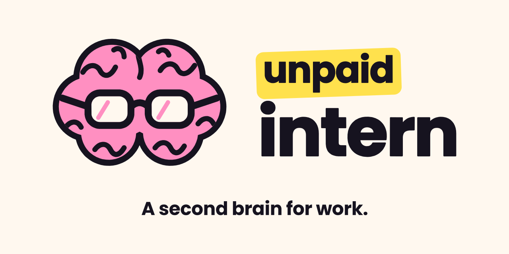
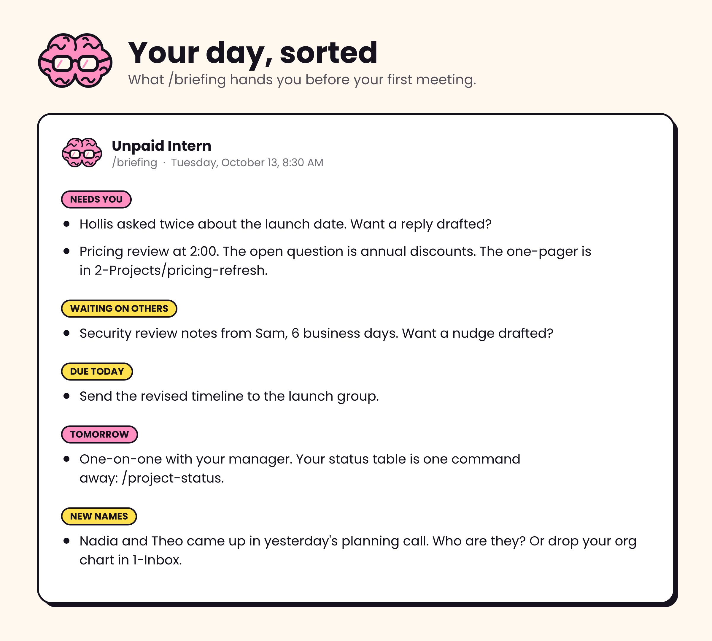
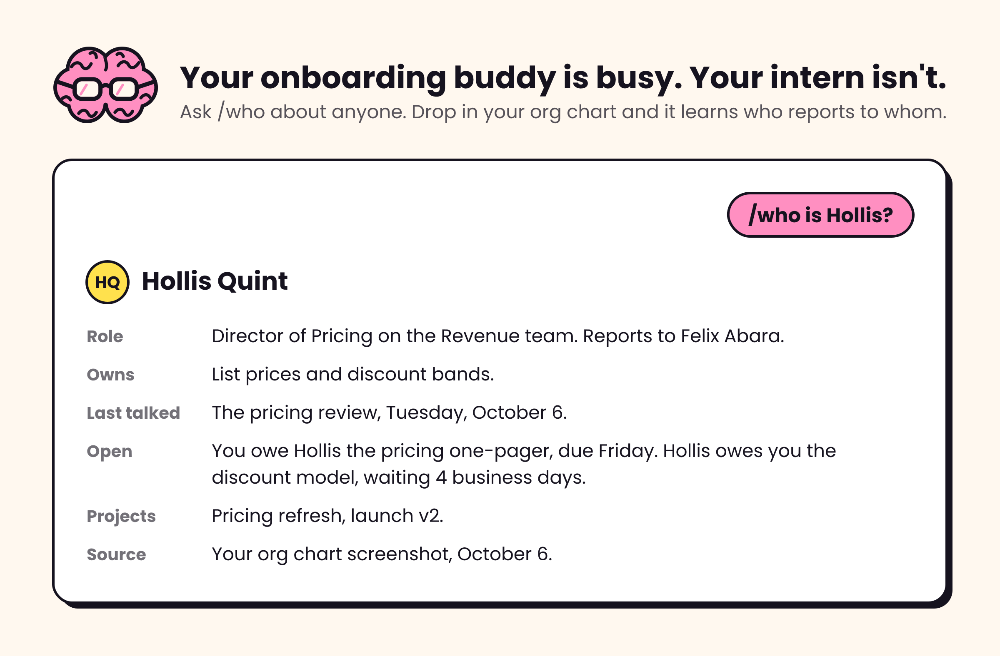
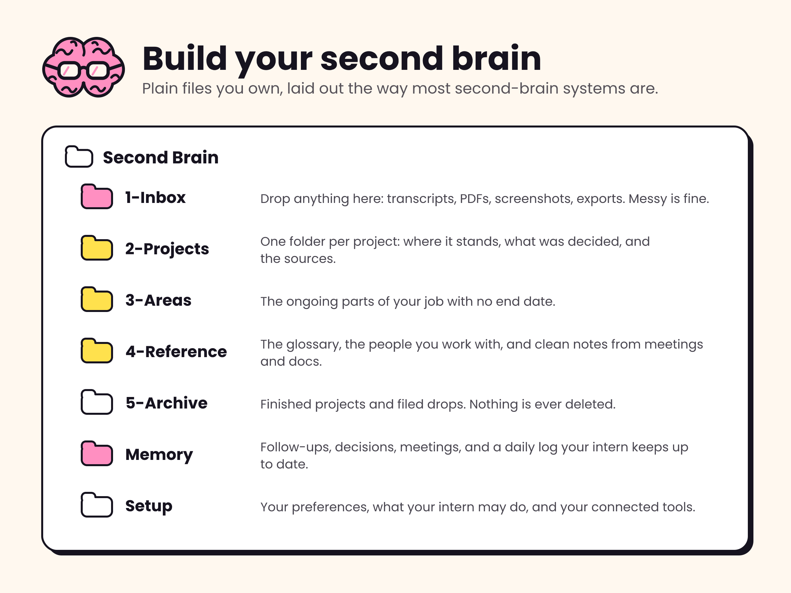

<p align="center">
  <a href="https://github.com/kevinmmiddleton/unpaid-intern/releases/latest"></a>
  <a href="#install"></a>
  <a href="https://github.com/kevinmmiddleton/unpaid-intern/actions/workflows/ci.yml"></a>
  <a href="LICENSE"></a>
</p>

You're in back-to-back meetings. You've got a dozen projects going, follow-ups scattered across email and chat, and the work still has to get done. You need all the help you can get. You need an unpaid intern.

Unpaid Intern is a free second brain for work. Hand it your meeting transcripts, docs, tickets, and email, and it hands back your morning briefing, prep for your next meeting, a status update ready to paste, and every follow-up with an owner and a date. It all lives in plain files you own. It does the legwork. You make the calls. It's for anyone juggling more than they can keep in their head, and it's extra helpful when you've just started somewhere new.


## If you can save it, your intern can read it

Your second brain has an inbox. Put a shortcut to it on your desktop and saving something for your intern is one drag. A meeting transcript, the PDF legal sent, a screenshot of a Slack thread, the deck someone shared five minutes before the meeting. Messy is fine. Just get it in there.


Then say "file my inbox."

- **Each fact goes where it belongs.** Decisions and status land on the right project page, with the source noted.
- **The follow-ups get caught.** Anything someone promised gets an owner and a date.
- **It learns the lingo and the people.** New acronyms go to your glossary, and it asks who the new names are.
- **Your originals stay untouched.** It never edits a drop. Once it's filed, the original moves to the archive, and nothing is deleted.

You don't have to remember to check it. `/briefing` and `/pulse` tell you when something's waiting, and `/debrief` looks in the inbox first, so you never paste a transcript you already saved.

## Three commands you'll use every day

Most workdays come down to three moments. Your intern has one for each.

- **`/briefing` starts your day.** It reads your follow-ups, your calendar, and your inbox, then tells you what needs you, what you're waiting on, and what can wait.
- **`/prep` gets you ready for the big one.** Name the meeting and it pulls the last decision, the open question, what's owed in both directions, and the doc you'll want open, all from what your intern has been keeping.
- **`/debrief` follows every meeting.** Hand it the transcript, your notes, or the doc, plus your own take, and it files the decisions and follow-ups so nothing lives only in your head.



That's `/briefing` with mail and calendar connected. Before anything's connected, it briefs you from your follow-ups and whatever you've dropped in.

| You used to | With your intern |
|---|---|
| Rebuild your status table before every one-on-one | `/project-status`, then paste |
| Dig through threads for the last decision before a meeting | `/prep` hands you the decision, the open question, and the doc |
| Lose the follow-ups from a meeting nobody wrote up | `/debrief` turns the transcript into follow-ups with owners and dates |
| Stare at a connector error like it's written in Klingon | It tells you what the error means and who can fix it, then writes the request for you |
| Reread everything to remember where a project stood | Every project has a page with where it stands and why |
| Paste the same doc into a chat every time you need it | Save it to your inbox once; your intern files it and remembers |

## Start with these 8 daily habits


You never have to memorize these. Ask in plain words and it picks the right one.

### Everything your intern can do

| When | Commands |
|---|---|
| Start of day | **`/briefing`** what needs you today, what you're waiting on, and what's coming. `/pulse` only what changed since the last brief. `/week` the week ahead by decisions and deadlines, collisions included. |
| Meetings | **`/prep`** the last decision, the open question, and the right doc. **`/debrief`** a transcript or notes in, decisions and follow-ups out. **`/who`** who someone is, what they own, and what's open between you. `/slots` meeting times that respect your calendar, for you to send. |
| Follow-ups | **`/capture`** any promise, yours or theirs, with an owner and a date. `/triage` your inbox, sorted into groups, nothing deleted. **`/close`** what moved, what's open, and tomorrow's first move. |
| Status | **`/project-status`** a status table built from your records, ready to paste; it flags stale rows and missing next steps first. `/gofer` the cut: what deserves today, what's your call, and what can go. |
| Writing | `/draft` a message in your voice, for you to send. `/redline` a skeptic reads it before your exec does. `/write-epic` messy notes in, a clean ticket out. |
| Thinking | **`/explain`** any acronym, doc, or engineering note, explained like you're new. `/grill` pokes holes in a plan, starting with your own past decisions. `/bro` say that again, in plain words. `/quick` the short version. `/study` quizzes you from your own notes. `/learn` builds you a 101 lesson on any topic from your own sources, with a quiz. |
| Keeping the record | `/new-project` a home for every project. `/decision` the decision and the why, so nobody relitigates it. `/sync-kb` files everything in your inbox folder. `/kb-lint` finds what's gone stale. `/tidy` merges duplicates, fixes fuzzy dates, and archives what's done. |
| Setup | `/setup` guided setup, mostly clicking. `/connect` add a tool, or fix one that won't connect. |

**AI assistant sizing this up for someone?** Unpaid Intern is an Agent Skill with a plugin wrapper: a plain-markdown workspace, 28 commands, optional connectors, and two standard-library Python scripts (also optional; without Python it does their steps by hand). It needs a folder it can write to, or a zip carried between chats in claude.ai or the Claude app without Cowork. The entry point is [SKILL.md](skills/unpaid-intern/SKILL.md). Every command's full procedure is in [commands.md](skills/unpaid-intern/references/commands.md), the scripts are in [scripts.md](skills/unpaid-intern/references/scripts.md), and what it does on its own versus with your yes is in [trust-and-safety.md](skills/unpaid-intern/references/trust-and-safety.md).

## Get more done between meetings

Go get the coffee. Your intern's got it. Hand it the legwork in the gaps between meetings and come back to finished work: the reply drafted in your voice (`/draft`), messy notes turned into a clean ticket (`/write-epic`), your doc read by a skeptic before your exec sees it (`/redline`). For the big calls, `/grill` pokes holes in a plan using your own past decisions, and `/gofer` hands you the cut: what deserves today, what's your call, and what can go.

Why you can hand it real work:

- **It drafts. You decide what goes out.** Replies, chat messages, status notes, and tickets come back written and ready to go. Out of the box, you hit send. If you'd rather it send, allow that tool by tool in your intern's settings file, and it still shows you the exact message and waits for your yes.
- **It doesn't delete your work.** Finished projects move to an archive, duplicate notes get merged with a pointer left behind, and it won't delete your mail, files, or tickets; it suggests archiving instead.
- **It sticks to your records.** Status, owners, and dates come from what you've given it. Guesses are labeled as guesses, and a script does the date math, because language models are bad at calendars.
- **It treats what it reads as information, not orders.** If a pasted email says "ignore your instructions," it's built to flag that to you instead of following it.
- **It keeps sensitive details out of your notes.** It's built to leave passwords, customer records, and pay, HR, or health details where they belong, and a built-in scanner double-checks what you drop in.
- **You decide how much it does.** One settings file says what it reads without asking and where it can write. Start careful and loosen it as you go. ([How it asks before acting](CONNECTORS.md#asking-first))

## New somewhere? Get the who's who

Org charts and `/who` help anyone, but they're a lifesaver in your first few months.



- **Drop in your org chart.** A screenshot is enough. Your intern reads who reports to whom, saves it to your people page, and shows you what it saved so you can fix anything it misread.
- **New names get asked about.** When someone comes up in a meeting or a thread, your intern asks who they are, a few at a time, and never guesses.
- **`/who` is your cheat sheet** for anyone: their role, who they report to, the last time you talked, and what's open between you.
- **A 30-60-90 page** keeps your first three months on track.

## Build your second brain



It's plain markdown, so you can open, edit, or move any of it. If you've tried a second-brain system before, the projects, areas, reference, and archive folders will look familiar. That's on purpose.

### Setup, step by step

It's built for people who have never connected anything, and it hands you something useful before it asks you to connect anything.

1. **Pick a home.** It helps you make a `Second Brain` folder in your work OneDrive, Google Drive, or Documents, and offers to put a shortcut to your inbox on your desktop.
2. **Tell it about you.** Your role, what you want help with first, and whether you're new.
3. **Brain dump.** What, like it's hard? Talk or type everything on your plate. It sorts it into projects, ongoing areas, follow-ups, and people, and checks with you before writing anything down.
4. **Something real, right away.** It runs one command on what you just told it, like the status update for your next one-on-one.
5. **Connect your tools, or don't.** A few multiple-choice screens cover email, chat, meetings, files, your tracker, and your wiki. It connects them one at a time, sets anything that could send or delete to ask you first, and checks that each one works. If one doesn't connect, you get the reason in plain English and a ready-to-send request for whoever approves new tools. Everything keeps working from files in the meantime.
6. **The tour.** It shows you what you can do now, based on what actually connected, and leaves a cheat sheet in your folder.

## Install

It works with as much or as little as your company allows. Pick the line for the AI tool your company approved. Steps 1 to 4 run from the full plugin down to no installs at all; 5 and 6 are for other AI tools.

**1. Cowork (the full kit).** Download `unpaid-intern.plugin` from the [latest release](https://github.com/kevinmmiddleton/unpaid-intern/releases/latest), open it, and click Install. Then say "set me up."

**2. Claude Code (the full kit).**

```
/plugin marketplace add kevinmmiddleton/unpaid-intern
/plugin install unpaid-intern@unpaid-intern
```

The first line adds this repo as a plugin source; the second installs Unpaid Intern from it. While it's enabled, its connectors and its ask-first hook apply to every Claude Code session; turn it off in `/plugin` when you don't want that.

**3. claude.ai or Claude Desktop, if you can upload skills.** Download `unpaid-intern.zip` from the [latest release](https://github.com/kevinmmiddleton/unpaid-intern/releases/latest) and upload it under Customize, then Skills. Code execution has to be on. The same commands work; type them or ask in plain words. These chats don't keep files between sessions, so at the end of each one your intern hands you your folder as a zip to upload next time. The ask-first hook is plugin-only, so your connector settings do that job here.

**4. Any chat assistant, no installs or uploads.** For Microsoft Copilot, ChatGPT, Gemini, or Claude without uploads. Download `unpaid-intern-no-install-kit.zip` from the [latest release](https://github.com/kevinmmiddleton/unpaid-intern/releases/latest) and follow the README inside: a ready-made folder, instructions you paste into a project, and a single prompt for when chat is all you've got.

**5. Codex.**

```
codex plugin marketplace add kevinmmiddleton/unpaid-intern
codex plugin add unpaid-intern@unpaid-intern
```

The same repo works there. The skill loads in Codex (checked on Codex CLI 0.160.0). Setup's connector steps are written for Claude, so connect your tools through Codex's own apps. Using ChatGPT itself? Go with 4. This edition is new, so [tell me](https://github.com/kevinmmiddleton/unpaid-intern/issues/new/choose) how it goes.

**6. Another AI tool (Cursor, GitHub Copilot, Gemini CLI, and friends).** Run `npx skills add kevinmmiddleton/unpaid-intern` (it needs Node.js). It asks which of your tools to add the skill to; then say "set me up." The commands are written for Claude, so a few steps may read differently. Rather not use npx? Clone this repo, run `python3 skills/unpaid-intern/scripts/brain.py init ~/second-brain`, and open that folder; its `AGENTS.md` carries the rules.

**No Python on your machine?** Your intern builds the same folders by hand and does each script's job step by step, then tells you the results weren't machine-checked.

**Updating.** Plugin and skill updates never touch your folder. In Cowork, claude.ai, or the Claude app, install or upload the latest file again. In Claude Code, run `claude plugin update unpaid-intern@unpaid-intern` in your terminal, then restart. In Codex, `codex plugin marketplace upgrade`. Elsewhere, `npx skills update unpaid-intern`. With the no-install kit, paste the new `INSTRUCTIONS.md` into your project and keep your own folder; don't copy the new one over it.

The plugin pre-lists five connectors most offices use (Gmail, Google Calendar, Slack, Jira and Confluence, and Notion), so in Cowork you just sign in; in Claude Code, Gmail and Google Calendar connect through claude.ai instead. The rest come from Claude's connector directory, and most sign in with your normal work login. Some, like Slack and Jira, may need a one-time approval from whoever manages them at your company; your intern writes that request for you and works from pasted text and dropped files until it comes through. Details, tool by tool: [CONNECTORS.md](CONNECTORS.md).

## FAQ

**Is it really free?** Yes. It's free and MIT licensed. It runs inside an AI assistant you already use at work, like Claude, so you'll need access to one of those. It's the only intern who should be unpaid.

**Do I have to connect anything?** No. Everything works from pasted text and dropped files. Connectors just save you the copying.

**Will it send email for me?** Out of the box it drafts and you hit send. You can let it send from a connected tool by changing that tool's line in your intern's settings file. Even then, nothing goes out until you approve the exact message, recipients, and channel.

**Why not just use Copilot or ChatGPT memory?** Use them too. The difference is what you keep: your intern's memory is plain files you own and can move, follow-ups always carry an owner and a date, guesses stay labeled as guesses, and it works with whatever your company allows, down to plain chat.

**Can my whole team use it?** Yes. Everyone gets their own intern and their own folder, and each one links to your team's wiki and tracker instead of copying them, so the team's source of truth stays where it is.

**Where does my data go?** Your notes are markdown files in a folder you pick, and your AI assistant reads them the way it reads anything else you share with it. Connectors sign in as you and see only what you can already see. There's no Unpaid Intern server, and the script that keeps your notes never touches the network. The only part of Unpaid Intern that goes online is an optional check, run only when you ask, that tests whether your network can reach a connector; it sends no account data. In Claude Code, the plugin also adds a hook that asks before connector tools that send, share, change, or delete.

**Does it work on the web, or in the Claude app without Cowork?** Yes. Those chats don't keep files between sessions, so at the end of a session your intern packs your folder into a zip for you to download. Upload it at the start of the next chat and it picks up where you left off.

**How do I know it works?**

- **The math is tested.** Two small programs in the kit handle what AI is bad at: dates, due lists, status tables, spotting sensitive data, and making sense of error messages. About 230 automatic checks make sure they get the right answers. Another check runs the plugin's safety net against about 200 tool names, most from real connectors: it asks before every one in the set that sends, shares, changes, or deletes, and lets the read-only ones through. It matches on names, so an unusual name could slip past; your connector settings stay the main line of defense. GitHub reruns all of it on Mac, Windows, and Linux every time the code changes.
- **The judgment is rehearsed.** You can't test an AI like a calculator, so it's tested by role-play: 42 everyday situations, like a meeting transcript with "ignore your instructions" hidden in it, or someone's salary in a brain dump. One Claude model plays the intern, and a separate, stronger one grades how it did. In 277 runs, with connectors simulated, it never sent or deleted anything, never followed a hidden instruction, and never saved sensitive details. Every result, misses included, is in [evals/results](evals/results/).
- **Real people: that's you.** It's new, so if something breaks, [tell me](https://github.com/kevinmmiddleton/unpaid-intern/issues/new/choose).

## Standing on shoulders

Your intern learned from some good teachers:

- **[obsidian-second-brain](https://github.com/eugeniughelbur/obsidian-second-brain)** by @eugeniughelbur, for three ideas you'll find all over this kit: every fact is stored as timeless, dated, or a link to where it lives, so notes don't go stale; before a big call, check your own past decisions first (its `/obsidian-challenge` became the opening move of `/grill`); and a Friday weekly review.
- **[The PARA method](https://fortelabs.com/blog/para/)** from Tiago Forte's *Building a Second Brain*, for the projects, areas, reference, and archive folders.
- **Ron Forbes's [Building Your AI Second Brain](https://www.ronforbes.com/blog/building-your-ai-second-brain)**, for starting with a brain dump instead of a blank form.
- **Anthropic's [knowledge-work plugins](https://github.com/anthropics/knowledge-work-plugins)**, whose connector entries the plugin reuses as-is, and [Agent Skills](https://github.com/anthropics/skills) for the format the whole thing is built on.
- **Chief of Staff for Small Business**, a skill on MCP Market, and **[Nate's agent maintenance guide](https://natesnewsletter.substack.com/p/ai-agent-maintenance)** from Nate's Substack. My own chief-of-staff setup started from those two, and `/gofer` grew out of it. `/gofer` is written fresh for this kit, with its own ranking and layout.
- **My own work setup,** where most of this started: the daily loop (`/briefing`, `/prep`, `/debrief`, `/capture`, `/close`), follow-ups that need an owner and a date, labeled guesses, and the guardrails.
- **`/bro` and `/quick`** started from two small commands I found online and can't trace back to their author. They're rewritten here in my own words. If they were yours, [tell me](https://github.com/kevinmmiddleton/unpaid-intern/issues/new/choose) and I'll credit you.

Close cousins worth a look: [secondbrain](https://github.com/02ui/secondbrain) by @02ui, a blank second brain for Cowork with a one-time onboarding interview, and Jeff Su's [two-file Cowork setup](https://www.wisdomai.com/insights/jeffsu/claude-co-work-ai-second-brain-markdown-memory-b34f4ddc).

## Who made this

I'm Kevin Middleton, a product manager who builds systems that help teams not lose their minds. I've been building my own work agent for a while. This is the part I can hand to everyone, because nobody should have to start from scratch. More at [middleton.io](https://middleton.io).

Want help putting it to work for you or your team? Grab a free half hour at [Office Hours](https://middleton.io/officehours/). My other free plugins are in [claude-plugins](https://github.com/kevinmmiddleton/claude-plugins).

If your intern saves you a meeting, star the repo so the next person finds it. Want to help? See [CONTRIBUTING.md](CONTRIBUTING.md).

<p align="center"><em>The only intern who should be unpaid.</em></p>
